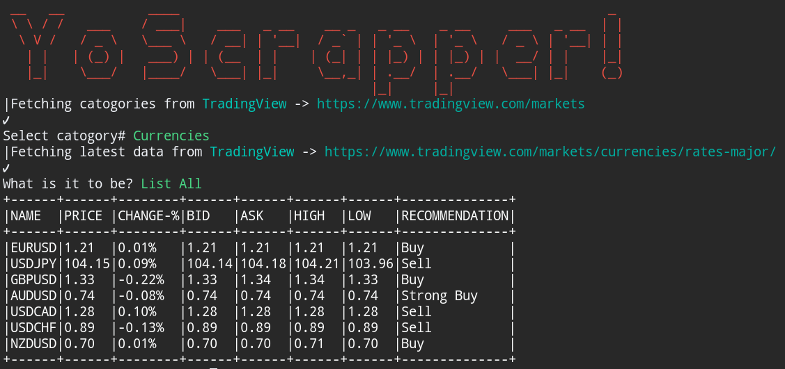
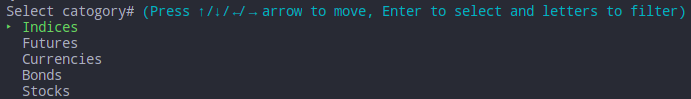
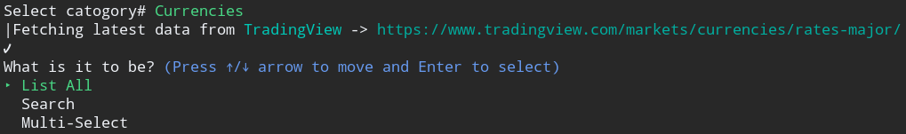
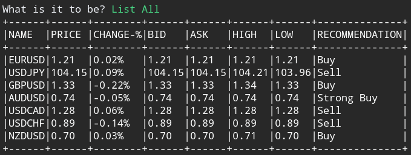
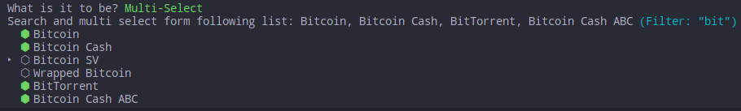

# Ruby Capstone Project 

## Trading View Data Scrapper 

This project is an Interactive Web Scrapper configured to scrap selective pages from [Trading View](https://www.tradingview.com). Gain financial information about top Stocks, Cryptocurrencies, Bonds etc. 

## To install and run

- Clone the project repo from [GitHub](https://github.com/bashforger/scraper/) using `git clone https://github.com/bashforger/scraper`
- Make sure [Ruby-lang](https://www.ruby-lang.org/en/) is installed
- Make sure [Bundler](https://bundler.io/) is installed
- Install the required gems. Run `bundle install`
- Run `ruby bin/scraper.rb`

## Usage Instructions

This application is fully interactive. 
You will rarely have to type any thing unless you want to interactively find or select something.  
- At launch it display you the main catogorie you want to scrap.

- After selecting the catogory, you have to chose b/w what operation you want to perform.

- In the end you have what you are looking for you can just press enter to perform the action. 

- You can also choose muti-select to search and display status of your fav currencies/stocks interactively.

You can preload orders by adding them to the "orders.txt" file, and they will be loaded when the application starts.

## Designed With
- Ruby
- Git
- Gitflows
- Rubocop
- RSpec
- Colorise
- Nokogiri
- TTY
- VS-Code

## Contribute to this Project

Contributions, issues, and feature requests are welcome! Start by:

  - Forking the project
  - Cloning the project to your local machine
  - cd into the project directory
  - Run git checkout -b your-branch-name
  - Make your contributions
  - Push your branch up to your forked repository
  - Open a Pull Request with a detailed description of the development branch of the original project for a review

## Author

👤 **Muhammad Adeel Danish**
- GitHub: [@githubhandle](https://github.com/bashforger)
- Twitter: [@twitterhandle](https://twitter.com/bashforge)
- LinkedIn: [@linkedIn](https://www.linkedin.com/in/muhammad-adeel-danish/)

## Show your support

Give a ⭐️ if you like this project!
